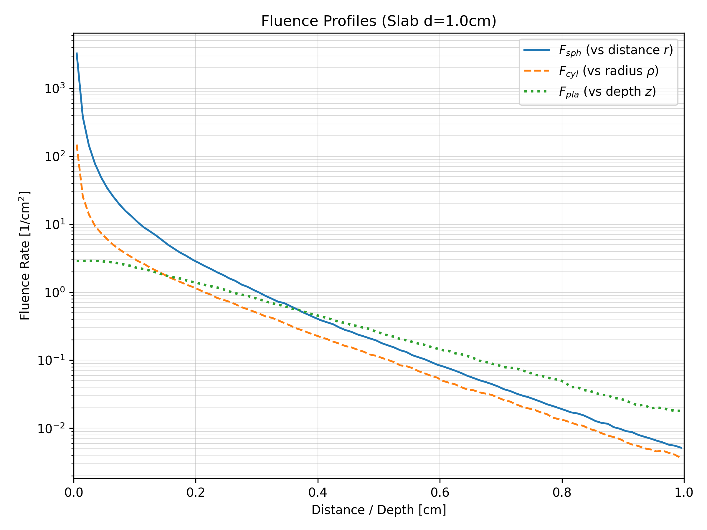
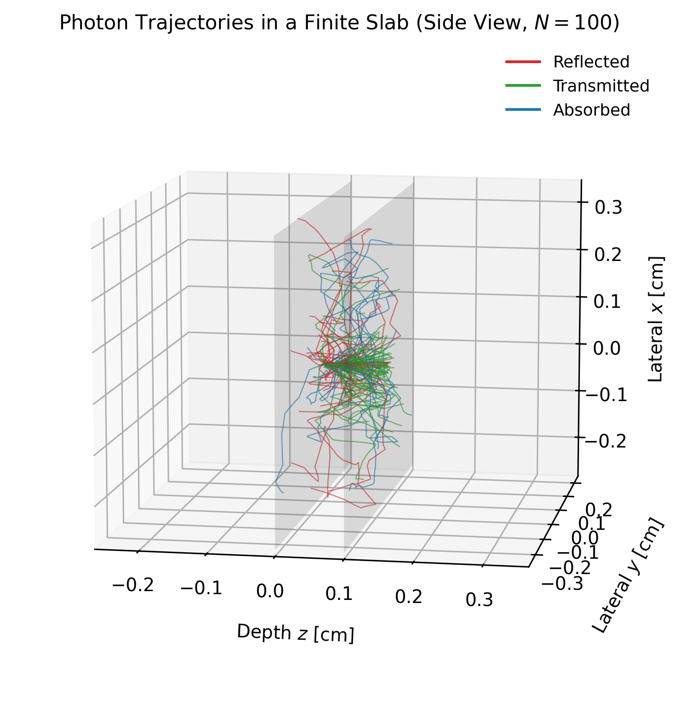
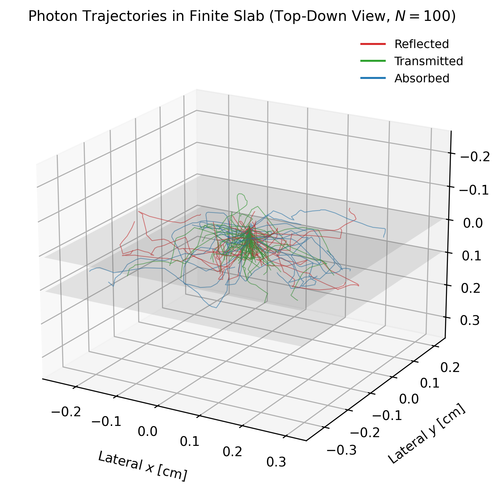

<div align="center">

# Monte Carlo Forward Model (Finite Slab)

[]()
[]()
[]()

</div>

Date: November 29, 2025<br>
Version: 1.1

## Project Overview
This project presents the development of a forward Monte Carlo simulator for photon transport
in turbid media (`mc_forward_jacques.py`, v1.1). The methodology follows **Chapter 5** of the
textbook *Optical-Thermal Response of Laser-Irradiated Tissue* [1] and incorporates boundary
rules from the standard **MCML** software package [2].

The simulation models a **finite slab** of tissue with thickness `d`, refractive index `n_t`, 
and external surroundings (air) with index `n_env`. A collimated *pencil-beam* (surface point source)
is launched at normal incidence onto the slab surface. Photons propagate through the medium 
via absorption and anisotropic scattering, while Fresnel reflection, refraction, and total 
internal reflection are applied at both slab boundaries.

This configuration yields the **Green’s function** (impulse response) of the slab to a narrow-beam excitation. This impulse response forms the fundamental building block for simulating broader illumination profiles using convolution methods (which can be implemented in future work), similar to those used in MCML and related photon-transport models [2].

This version (v1.1) implements the Finite Slab Geometry, representing a “Pencil Beam” experiment.
## 📁 Folder Structure
``` 
mc-forward-jacques/
├── mc_forward_jacques.py   # Core Monte Carlo simulation logic (Finite Slab)
├── vis_trajectories.py     # Helper script to visualize photon trajectories
├── demo_forward.py         # Script to run the simulation and generate plots
├── figs/                   # Output fluence plots
├── report/                 # Project report (LaTeX source)
└── README.md
```

## 🚀 Key Features

### Geometry
- Finite tissue slab of thickness **d** with Air/Tissue interfaces.
- Collimated “Pencil Beam” source entering perpendicular to the surface.

### Physics
- **Fresnel reflection & refraction** at both boundaries (Snell’s Law).
- **Henyey–Greenstein scattering** (anisotropy parameter **g**).
- **Absorption & scattering** follow the MCML model.

### Verification
- Ensures **energy conservation ≈ 1.0** (Reflectance + Transmittance + Absorption).


## ▶️ How to Run
1. Install Requirements:

* Python 3.10+
* NumPy
* Matplotlib
```bash
pip install numpy matplotlib
```

2. Run the Simulation:
Run the demo script to perform the Monte Carlo simulation and generate the Jacques-style fluence plot:
```bash
python demo_forward.py
 ```
This generates: figs/Fluence_Slab_Comparison.png

3. Visualize Trajectories:
Run the visualization script to generate 3D trajectory plots:
```bash
python vis_trajectories.py
```

This generates:
- `figs/trajectories_side_view.png`
- `figs/trajectories_top_down.png`


## 📊 Visualization of Results






## 📚 References
1. S. L. Jacques, “Monte carlo modeling of light transport in tissue,” in Optical-Thermal Re-
sponse of Laser-Irradiated Tissue, pp. 109–144, Springer, 2011.
2. L. Wang and S. L. Jacques, Monte Carlo Modeling of Light Transport in Multi-layered Tissues
in Standard C. Optical Imaging Laboratory, Oregon Medical Laser Center, US, Portland, 1992. Online; accessed 2025
